# ComfyUI Themes by Coolat / FreeCraftLog

ComfyUI用カスタムテーマ集です。

## テーマ一覧

### Seasonal（季節）

| スクショ | テーマ名 | ファイル | コンセプト |
| -------- | -------- | -------- | ---------- |
| 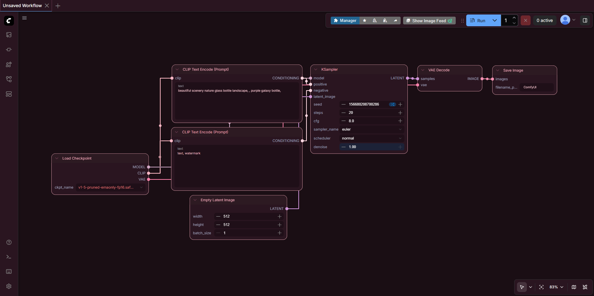 | Sakura Night | `themes/seasonal/sakura-night.json` | 夜桜 — ダーク背景に桜ピンクのアクセント |
| 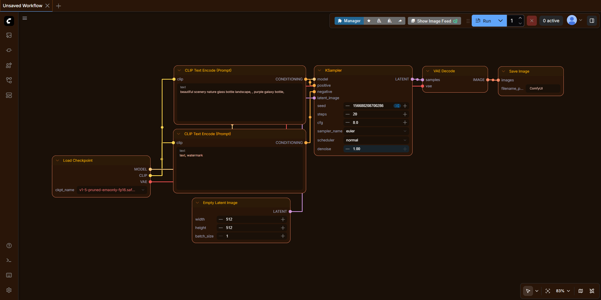 | Autumn Ember | `themes/seasonal/autumn-ember.json` | 秋の夕暮れ — バーントオレンジ×ゴールド |
| 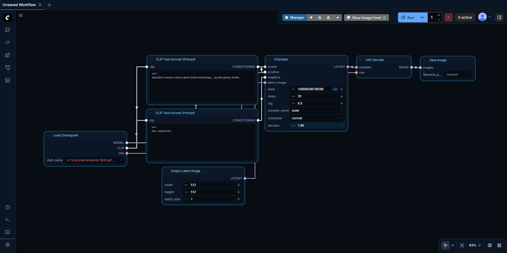 | Winter Frost | `themes/seasonal/winter-frost.json` | 冬の静けさ — ダークネイビー×アイスブルー |
|  | Summer Night | `themes/seasonal/summer-night.json` | 夏の夜 — ネイビー×ネオンシアン×コーラル |

### Japanese（和風）

| スクショ | テーマ名 | ファイル | コンセプト |
| -------- | -------- | -------- | ---------- |
| 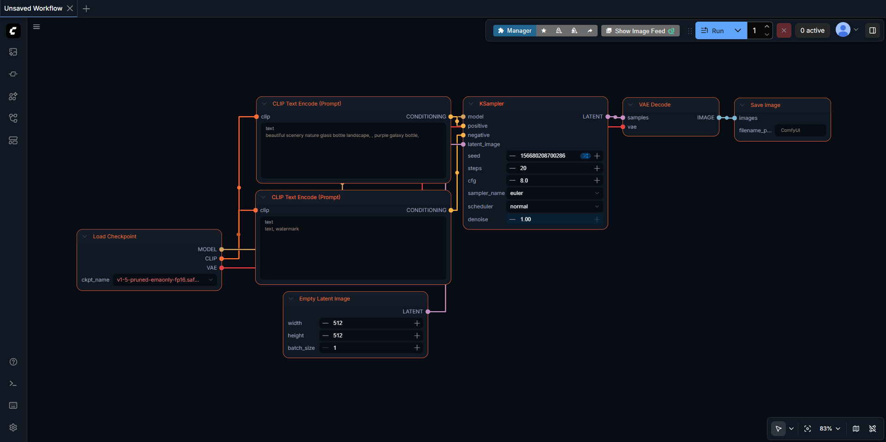 | Edo Night | `themes/japanese/edo-night.json` | 江戸の夜 — 墨黒×朱赤×金 |
| 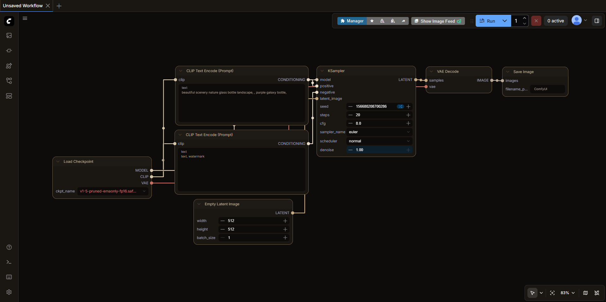 | Wabi-Sabi | `themes/japanese/wabi-sabi.json` | 侘び寂び — くすみグレー×土の温もり |

### Cyberpunk（サイバーパンク）

| スクショ | テーマ名 | ファイル | コンセプト |
| -------- | -------- | -------- | ---------- |
| 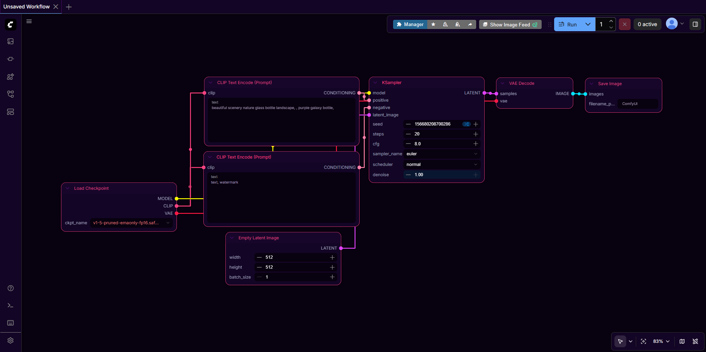 | Cyberpunk Neon | `themes/cyberpunk/cyberpunk-neon.json` | 近未来都市 — ブラック×マゼンタ×シアン |
| 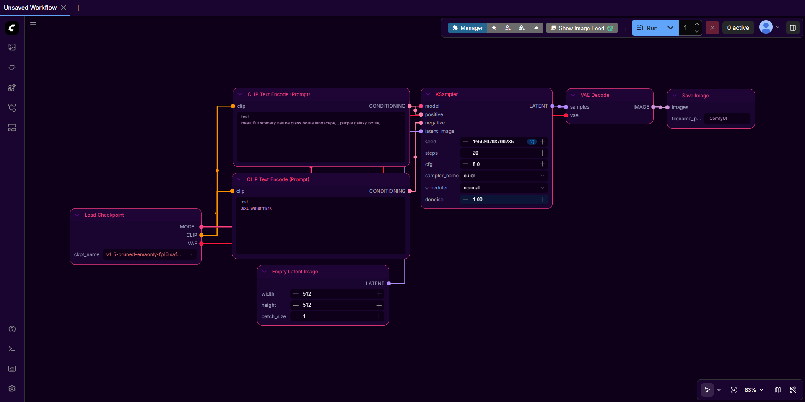 | Synthwave | `themes/cyberpunk/synthwave.json` | 80年代レトロフューチャー — パープル×ピンク |

### Nature（自然）

| スクショ | テーマ名 | ファイル | コンセプト |
| -------- | -------- | -------- | ---------- |
| 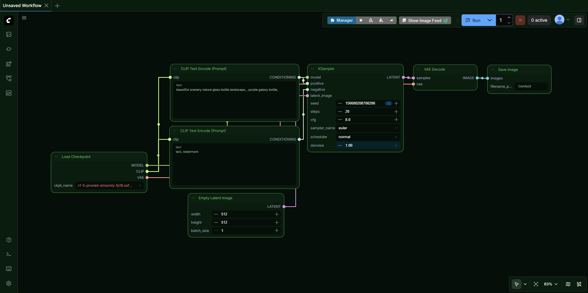 | Deep Forest | `themes/nature/deep-forest.json` | 深い森 — ダークグリーン×苔の緑 |
| 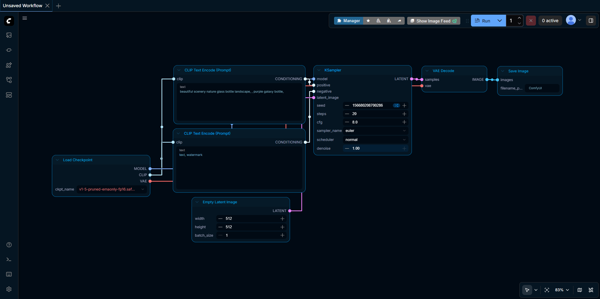 | Ocean Deep | `themes/nature/ocean-deep.json` | 深海 — ディープブルー×バイオルミネセンス |

### Lofi（ローファイ）

| スクショ | テーマ名 | ファイル | コンセプト |
| -------- | -------- | -------- | ---------- |
| 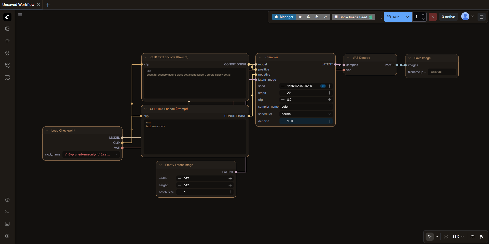 | Lofi Coffee | `themes/lofi/lofi-coffee.json` | カフェのまったり時間 — ブラウン×クリーム |
| 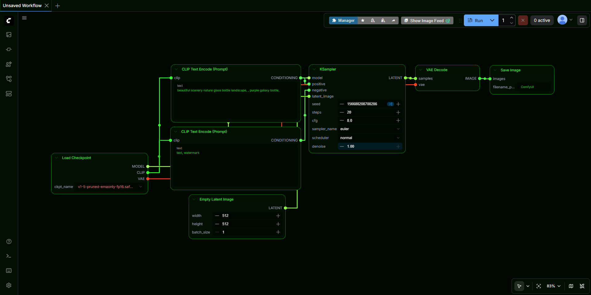 | Retro CRT | `themes/lofi/retro-crt.json` | ブラウン管の温もり — アンバー×ダークグリーン |

### Original（オリジナル）

| スクショ | テーマ名 | ファイル | コンセプト |
| -------- | -------- | -------- | ---------- |
| 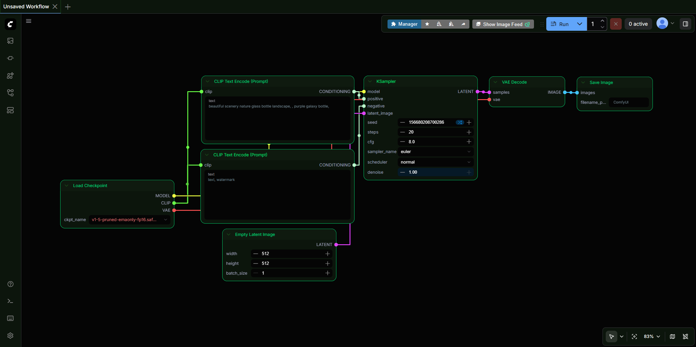 | Midnight Engineer | `themes/original/midnight-engineer.json` | ターミナル系エンジニアダーク — ブラック×グリーン |
| 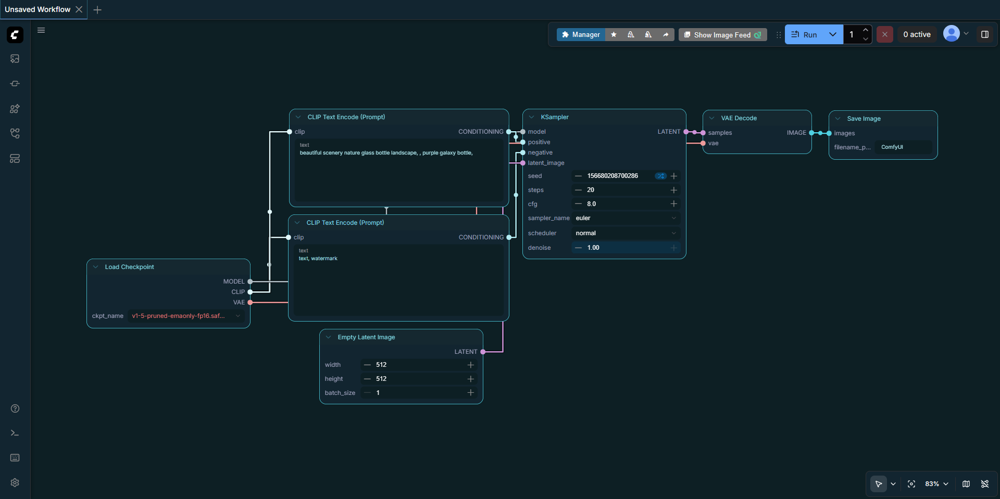 | Rumina | `themes/original/rumina.json` | ターコイズ×シルバー、オリジナルキャラ「瑠水奈」イメージ |

## インストール方法

1. 使いたい `.json` ファイルをダウンロード
2. ComfyUI を起動
3. 設定 → Appearance → Color Palette → 📂 アイコン（Import）
4. ダウンロードした JSON ファイルを選択
5. テーマ一覧から選んで適用

## 動作確認環境

- ComfyUI frontend 1.20.5 以降

## 配布元

- Blog: [FreeCraftLog](https://freecraftlog.com)
- GitHub: Ryohei Tanaka
